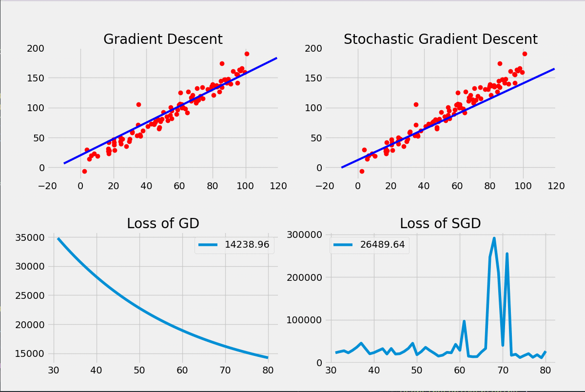

Linear regression by using both gradient descent and stochastic gradient descent. Thus, can see the differences between them.

Used numpy and matplotlib libraries.

### Setup
- Install numpy and matplotlib libraries on your environment.
- You can change the hyperparameters like learning rate, slope, bias, etc. (optional) 
- Run it
